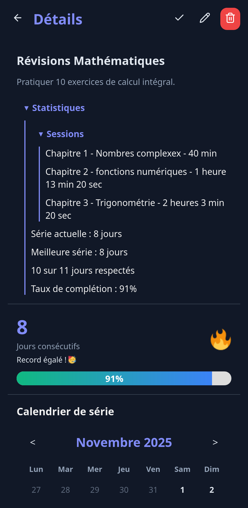

# 🌟 **MyStreak – Suivi d’Habitudes Minimaliste & Puissant**

**MyStreak** est une **application web progressive (PWA)** simple, rapide et axée sur la discipline. Elle vous aide à construire et maintenir vos habitudes grâce au principe des **streaks** : chaque jour où vous validez une routine ajoute un 🔥… et l’objectif est de **ne jamais briser la chaîne**.

## 🎯 **Objectif**

Renforcer la constance.
Qu’il s’agisse de sport, lecture, révision, méditation ou finance : MyStreak transforme vos objectifs en un jeu motivant basé sur la régularité quotidienne.

## ✨ **Fonctionnalités**

* ✔️ **Gestion des routines** : créer, modifier, supprimer, personnaliser
* 🔥 **Séries (streaks)** : série actuelle + meilleure série historique
* 📆 **Calendrier visuel** : jours réussis (🔥) et manqués (🧊)
* ⏱️ **Chronométrage de sessions** : nom + durée pour les routines basées sur le temps
* 📊 **Statistiques avancées** : taux de complétion global et détaillé
* 💾 **Persistance locale** : tout est stocké dans le navigateur (localStorage)
* 💬 **Citations motivantes** à chaque lancement
* 📱 **PWA** : installable sur téléphone, tablette et PC, fonctionne hors ligne

## 🖼️ **Aperçus d'Interface**

| Accueil                               | Calendrier                                   | Chronomètre                           | Statistiques                         |
| ------------------------------------- | -------------------------------------------- | ------------------------------------- | ------------------------------------ |
|  |  |  |  |

## 🛠️ **Technologies**

* **React + TypeScript**
* **Vite**
* **CSS Modules**
* **react-router-dom**, **react-modal**, **react-icons**, **lucide-react**
* **Context API** + classes de services (`RoutineManager`)

## 🚀 **Installation**

```bash
git clone https://github.com/ton-repo/mystreaks.git
cd mystreaks
npm install
npm run dev
```

Build de production :

```bash
npm run build
npm run preview
```

